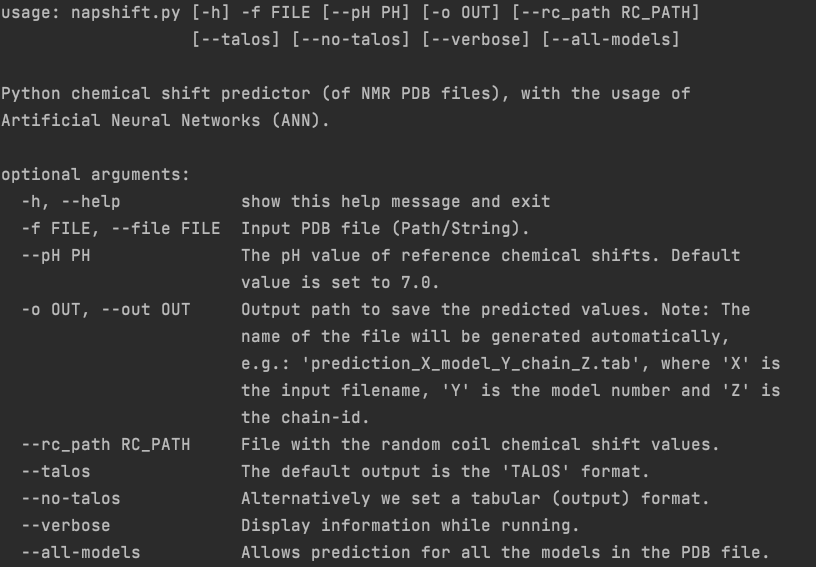

# NapShift (version 0.1)
---

This repository provides a "Python implementation" of the NapShift program
to estimate the backbone atoms' chemical shift values from NMR protein PBD
files.

M. Vrettas, PhD.

## Installation
---

There are two options to install the software.

1. The easiest way is to visit the GitHub web-page of the project and
[download the code](https://github.com/vrettasm/NapShift/archive/master.zip)
in zip format. This option does not require a prior installation of git on the
computer.

2. Alternatively one can clone the project directly using git as follows:

    `$ git clone https://github.com/vrettasm/NapShift.git`

## Required packages

The recommended version is **Python 3.6** and above. Some required packages
are:

>
> tensorflow, numpy, pathlib, pandas, etc.
>

To simplify the required packages just use:

    $ pip install -r requirements.txt

## Virtual environment

It is highly advised to create a single virtual environment to avoid
messing with the main Python installation. On Linux and macOS systems
type:

    $ python3 -m venv napshift_venv

Note: "napshift_venv" is an optional name.

Once the virtual environment is created activate it with:

    $ source napshift_venv/bin/activate

Then we can install all the requirements as above:

    $ pip3 install -r requirements.txt

or

    $ python3 -m pip install -r requirements.txt

N.B. For Windows systems follow the relevant instructions.

## How to run
---

To execute the program (within the activated virtual environment), first navigate
to the main directory of the project (i.e. where the napshift.py is located), and
then run the following command:

    $ ./napshift.py -f path/to/PDB/file

This is the simplest way to run NapShift. It will create a file named:
"prediction_filename_model_0_chain_A.tab" in the current working directory,
with the predicted chemical shift values for all backbone atoms (N, C, Ca, Cb, H, Ha).

To explore all the options of NapShift, use:

    $ ./napshift.py -h

You will see the following menu:

## References
---

The work is described in detail at:

1.  [Alfonso De Simone, etc. (2021)](https://doi.org/...).

### Contact
---

For any questions/comments (*regarding this code*) please contact me at:
vrettasm@gmail.com