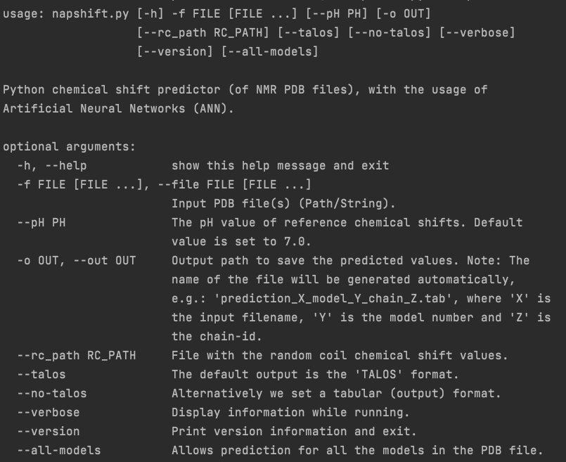

# NapShift (version 1.0.1)

This repository provides a "Python implementation" of the NapShift program
to estimate the backbone atoms' chemical shift values from NMR protein PBD
files.

M. Vrettas, PhD.

## Installation

There are two options to install the software.

1. The easiest way is to visit the GitHub web-page of the project and
[download the code](https://github.com/vrettasm/NapShift/archive/master.zip)
in zip format. This option does not require a prior installation of git on the
computer.

2. Alternatively one can clone the project directly using git as follows:

    `$ git clone https://github.com/vrettasm/NapShift.git`

## Required packages

The minimum version is **Python 3.7** (recommended >=3.8). The required packages
are given in the "requirements.txt": To simplify the installation of the packages just use:

    $ pip install -r requirements.txt

## Virtual environment (recommended)

It is highly advised to create a separate virtual environment to avoid
messing with the main Python installation. On Linux and macOS systems
type:

    $ python3 -m venv napshift_venv

Note: "napshift_venv" is an _optional_ name.

Once the virtual environment is created activate it with:

    $ source napshift_venv/bin/activate

Make sure **pip** is updated:

    $ python3 -m pip install --upgrade pip

Then we can install all the requirements as above:

    $ pip install -r requirements.txt

or

    $ python3 -m pip install -r requirements.txt

N.B. For Windows systems follow the **equivalent** instructions.

## For Conda users

A conda environment_napshift.yml file is provided with all the required dependencies.

    $ conda env create -f environment_napshift.yml
    $ conda activate venv_napshift

## How to run

To execute the program (within the activated virtual environment), you can either
navigate  to the main directory of the project (i.e. where the napshift.py is located),
or locate it through the command line and then run the following command:

    $ ./napshift.py -f path/to/filename.pdb

This is the simplest way to run NapShift. It will create a file named:
"prediction_filename_model_0_chain_A.tab" in the _current working directory_,
with the predicted chemical shift values for all backbone atoms (N, C, Ca, Cb, H, Ha).

   > **Hint**: If you want to run the program on multiple files (in the same directory) you
   > can use the '*' wildcard as follows:
   >  
   > $ ./napshift.py -f path/to/*.pdb

This will run NapShift on all the files (in the directory) with the '.pdb' extension.

---

To explore all the options of NapShift, use:

    $ ./napshift.py -h

You will see the following menu:

## References (and documentation)

The original work is described in detail at:

1. [G. Qi, M. D. Vrettas, C. Biancaniello, M. Sanz-Hernandez, C. T. Cafolla, J. W. R. Morgan,
Y. Wang, A. De Simone, and D. J. Wales (2022)](https://pubs.acs.org/doi/10.1021/acs.jctc.2c00657).
"Enhancing Biomolecular Simulations With Hybrid Potentials Incorporating NMR Data."
Journal of Chemical Theory and Computation, DOI: 10.1021/acs.jctc.2c00657.

2. The documentation of the code can be found in: [NapShift_v01-doc](./docs/NapShift_v01.pdf).

### Contact

For any questions/comments (**_regarding this code_**) please contact me at:
vrettasm@gmail.com